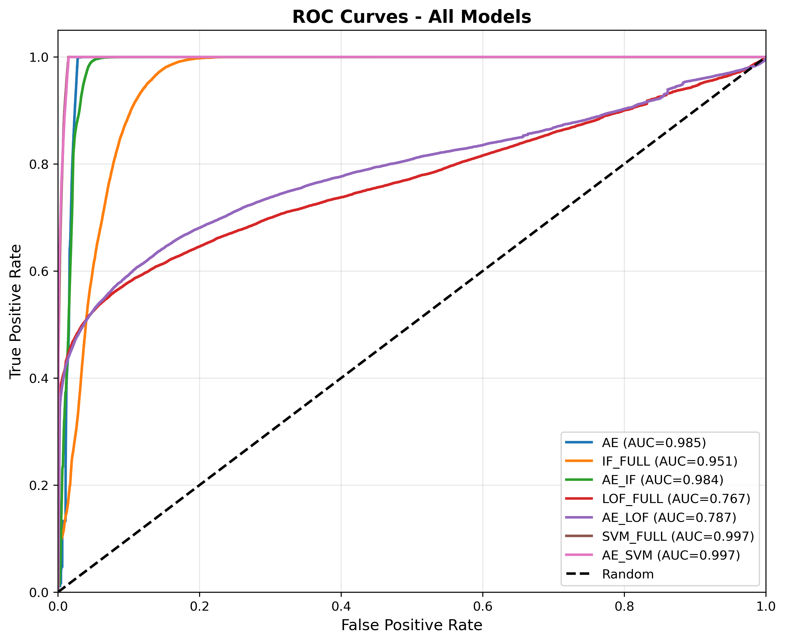
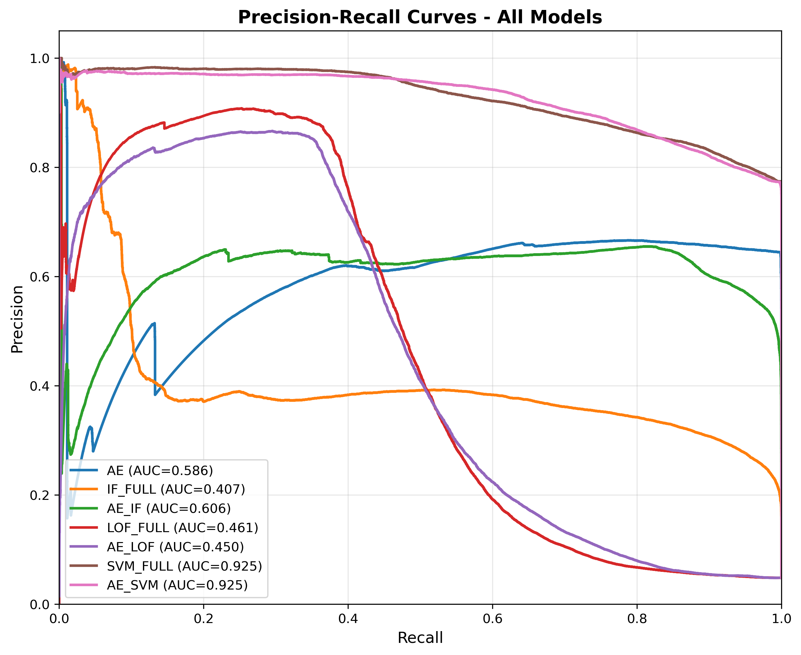
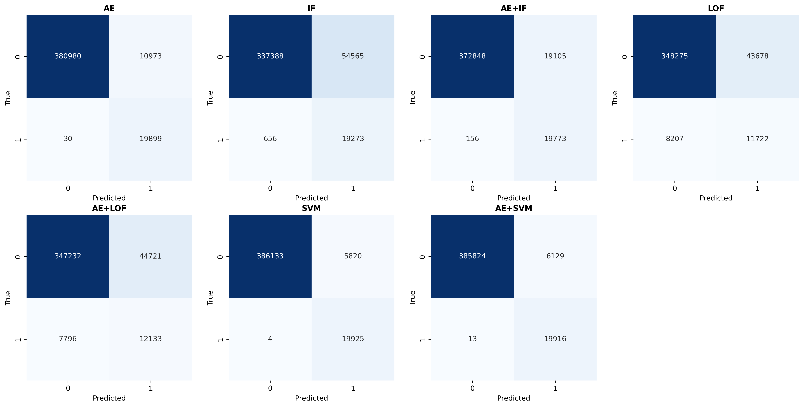
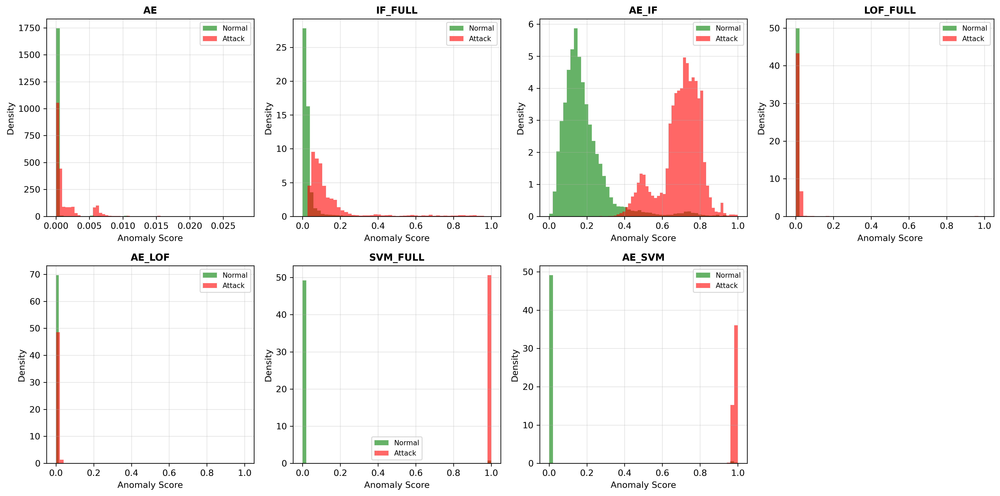

<h1 align="center">A Comprehensive Study of Anomaly Detection Models for Network Security Using the UNSW-NB15 Dataset</h1>

<p align="center">
  <b>Autoencoder | Isolation Forest | LOF | SVM | Hybrid Models</b><br>
  <i>Machine Learning • Cybersecurity • Intrusion Detection</i>
</p>

<p align="center">
  
  
  
  
  
  
</p>

## 🔒 Project Summary

“Benchmarking Autoencoder, Isolation Forest, LOF, SVM, and Hybrid Models for Network Intrusion Detection on UNSW-NB15 with complete statistical validation and ML pipeline.”
This repository contains a **full experimental study and model comparison** of anomaly detection techniques for network intrusion detection using the **UNSW-NB15 dataset**.
The work benchmarks **7 models** — standalone & hybrid — and includes:

* Autoencoder (AE)
* Isolation Forest (IF)
* Local Outlier Factor (LOF)
* Support Vector Machine (SVM)
* AE + LOF
* AE + IF
* AE + SVM

The study evaluates them on **ROC-AUC**, **PR-AUC**, **F1-Score**, **Precision**, **Recall**, and **Accuracy**, backed by **statistical significance tests** (Friedman, Paired t-test, Bootstrap CIs).

---

# 📂 **Repository Structure**

```
📁 figures/
   ├── confusion_matrices_all.png
   ├── model_comparison_metrics.png
   ├── pairwise_significance.png
   ├── pr_curves_comparison.png
   ├── roc_curves_comparison.png
   ├── score_distributions.png
   └── Boxplot of Numerical Columns (Checking Outliers).png

📁 results/
   ├── FINAL_REPORT.txt
   ├── latex_table.tex
   ├── model_comparison.csv
   ├── model_complexity.csv
   ├── performance_summary.csv
   └── statistical_tests.txt

📄 main.ipynb     → Full code for preprocessing, training, evaluation
📄 README.md      → (this file)
```

---

# 🚀 **1. Introduction**

Modern network environments face increasingly sophisticated cyberattacks. Conventional signature-based IDS fail to detect **zero-day attacks**, leading to a shift toward anomaly-based, ML-driven IDS.

This project provides:

✔ A unified preprocessing pipeline
✔ Standalone vs hybrid model comparison
✔ Statistical validation for robust conclusions
✔ Visualizations for interpretability
✔ Dimensionality-reduced hybrid modelling

---

# 📊 **2. Dataset: UNSW-NB15**

| Property        | Details                        |
| --------------- | ------------------------------ |
| Total Records   | 2,540,044                      |
| Classes         | Normal + 9 Attack Categories   |
| Features        | 49 raw → 194 after encoding    |
| Split           | Train 64% / Val 16% / Test 20% |
| Class Imbalance | Normal ≈ 87%, Attack ≈ 13%     |

Includes attack categories: *Fuzzers, DoS, Reconnaissance, Exploits, Backdoors, Generic, Worms,* etc.

---

# 🔧 **3. Methodology**

### ✔ Preprocessing

* Missing value imputation
* Duplicate removal (480k+ rows)
* Hybrid encoding (One-Hot + Frequency Encoding)
* Min-Max scaling
* Stratified splits

### ✔ Models Trained

| Type           | Models                |
| -------------- | --------------------- |
| **Standalone** | AE, IF, LOF, SVM      |
| **Hybrid**     | AE+IF, AE+LOF, AE+SVM |

### ✔ Statistical Analysis

* **Bootstrap 95% CI**
* **Paired t-tests** (vs SVM)
* **Friedman Test**

---

# 📈 **4. Key Results**

## 🔥 **Top Performer: SVM**

* **ROC-AUC:** 0.9968
* **F1-Score:** 0.8725
* **Recall:** 0.9998
* **Precision:** 0.7739

### 🥈 Runner Up: AE + SVM

* **F1-Score:** 0.8664
* **ROC-AUC:** 0.9968
* 194 ➝ 32-dimensional latent space

### 📌 High-Recall Models

* Autoencoder: Recall = 0.9985
* AE + IF: Recall = 0.9922

### ⚠ Low-Performers

* LOF & AE+LOF struggle due to high dimensionality.
* LOF F1 < 0.32

---

# 🧪 **5. Visualizations**

All figures are inside `/figures`.

### ✔ ROC Curves



### ✔ PR Curves



### ✔ Confusion Matrices



### ✔ Score Distributions



---

# 📐 **6. Statistical Significance Summary**

| Test                       | Result                               |
| -------------------------- | ------------------------------------ |
| **Bootstrap CI**           | SVM has tight 95% CI (0.9967–0.9969) |
| **Paired t-test (vs SVM)** | All comparisons p < 0.0001           |
| **Friedman test**          | χ² = 153,166.36, p < 0.0001          |

✔ Confirms SVM significantly outperforms all others.

---

# ⚙ **7. Model Complexity Summary**

| Model    | Training Samples | Features | Time   | Notes                      |
| -------- | ---------------- | -------- | ------ | -------------------------- |
| AE       | 1.25M            | 194      | High   | Best unsupervised model    |
| IF       | 1.31M            | 100      | Medium | High recall, low precision |
| AE + IF  | 50k              | 32       | Medium | Balanced                   |
| AE + LOF | 50k              | 32       | High   | LOF struggles in high-D    |
| SVM      | 60k              | 100      | High   | Best performance           |
| AE + SVM | 60k              | 32       | High   | Best hybrid model          |

---

# 📚 **8. Files Included**

### 📁 `/results`

Contains all metrics, tables, and statistical tests such as:

* **model_comparison.csv**
* **performance_summary.csv**
* **statistical_tests.txt**
* **latex_table.tex**
* **FINAL_REPORT.txt**

### 📄 main.ipynb

Complete end-to-end pipeline:

* Preprocessing
* Feature engineering
* Training all models
* Threshold optimization
* Evaluation + plotting

---

# 🏁 **9. Conclusion**

This project establishes that:

* **SVM is the most effective** model for anomaly detection on UNSW-NB15.
* **AE + SVM** provides near-equal performance with **84% feature reduction**.
* Unsupervised models are useful but cannot match supervised accuracy.
* Hybrid models offer strong trade-offs between precision, recall, and computational cost.
* Statistical validation confirms the significance of performance differences.

This repository serves as a **strong benchmark** and can be extended for:

* Real-time IDS
* Ensemble methods
* Deep hybrid architectures
* Attention-based feature extraction

---

# 🙌 **10. Author**

**Karthick S**
Artificial Intelligence & Data Science
Rajalakshmi Engineering College

---

# **Tags**
machine-learning, cybersecurity, anomaly-detection,
intrusion-detection-system, unsw-nb15, autoencoder,
svm, lof, isolation-forest, hybrid-models, python,
research-project, data-science
